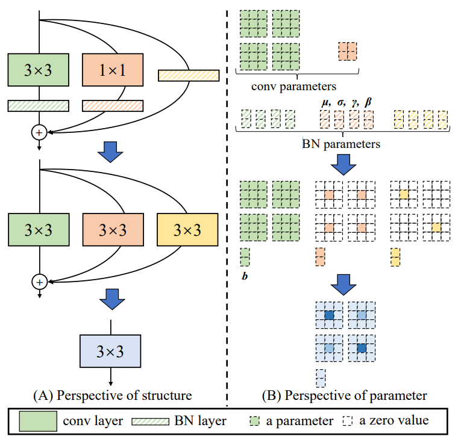

# 卷积残差模块算子融合

+ 论文链接：[RepVGG: Making VGG-style ConvNets Great Again](https://arxiv.org/abs/2101.03697)

## 1. 知识点

### 1.1 point-wise convolution：

+ 1 * 1的卷积核，作用是不考虑相邻像素点的局部关联性，只考虑不同通道之间的融合

### 1.2 depth-wise convolution（深度可分离卷积）

+ 设置 conv2d 的 group 参数，将通道分组进行融合

### 1.3 conv_2d.weight.shape

```commandline
conv_2d = conv2d(in_channels, out_channels, kernel_size)
print(conv_2d.weight.shape)
# 输出形状为四维 [out_channels, in_channels, kernel_h, kernel_w]
```

## 2. 算子融合（主要是用在inference阶段）

+ 把 point-wise 卷积和 x 本身卷积都写成 3 * 3 的卷积

+ 最终把三个卷积写成一个卷积（用卷积的结合律）



### 2.1 point-wise卷积 -> 3 * 3

+ 不考虑相邻点融合：3 * 3卷积里，最中间为1，其余都为0

+ weight.shape：[2, 2, 1, 1] -> [2, 2, 3, 3]

### 2.2 x本身 -> 3 * 3

+ 卷积过后还是本身，则不考虑相邻点融合，不考虑通道间融合。 

+ 不考虑相邻点融合：最中间为1，其余都为0

+ 不考虑通道间融合：共有2 * 2 = 4个卷积核
  
  + 最中间为1，其余都为0
  
  + 全0卷积核：避免in_channels的第二个通道对第一个通道的影响
  
  + 全0卷积核：避免in_channels的第一个通道对第二个通道的影响
  
  + 最中间为1，其余都为0

## 3. 结论

算子融合后不仅满足ResNet所有要求，而且运行速度更快