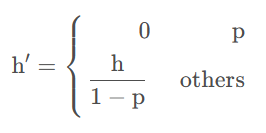
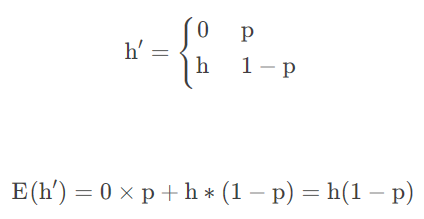

# Dropout

+ 论文链接：[Dropout: A Simple Way to Prevent Neural Networks from
  Overfitting](https://www.cs.toronto.edu/~hinton/absps/JMLRdropout.pdf)

## 1. 原理

## 2. 公式

+ 每个神经单元以概率p被去除。即权重置0

+ 留下的神经单元权重值乘以1 / (1 - p)

### 2.1 剩余神经元权重值乘 1 / (1 - p) 的原因

为了保证样本的期望

## 3. Dropout的numpy实现

### 3.1.1 第一种实现

训练模式下丢弃部分权重，测试模式值需要乘以(1 - p)。

因为测试阶段不使用dropout，所以为了使得train mode和test mode保持期望一致，那么我们需要将所有的值乘以(1-p)

+ train mode
  
  

+ test mode
  
  

### 3.2.2 第二种实现

训练模式下丢弃部分权重，乘以系数 1 / (1 - p)，这样就保证期望不变，那么测试模式值就可以不做处理。

+ train mode
  
  
+ test mode
  
  

## 4. 小结

pytorch的c++源码采用的是第二种实现，即训练时进行scale操作，减少inference计算量
