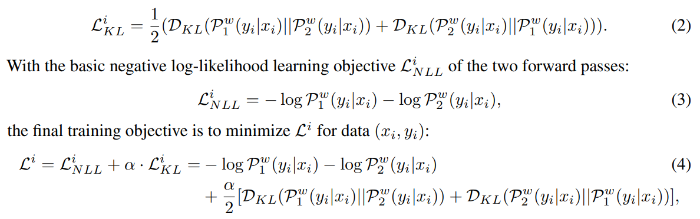
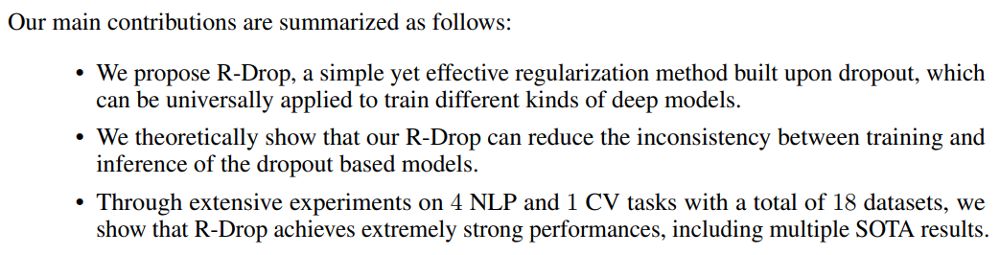

# R-Dropout

+ 论文链接：[R-Drop: Regularized Dropout for Neural Networks](https://arxiv.org/abs/2106.14448)

## 1. 原理

## 2. 算法

## 3. 损失函数

## 4. 贡献

## 5. 小结

提出R-Drop在多种模型上效果都很好，但本篇论文主要是在transformer上进行实验，未在其他模型上实验，可以自行尝试
